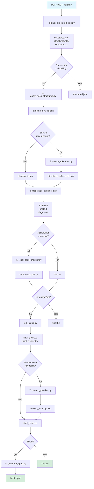

# Схема обработки PDF

## Визуальная схема пайплайна



## Текстовая схема

```
┌─────────────────────────────────────────────────────────────────┐
│                    PDF с OCR текстовым слоем                    │
└────────────────────────────┬────────────────────────────────────┘
                             │
                             ▼
┌─────────────────────────────────────────────────────────────────┐
│ 1. extract_structured_text.py                                  │
│    • Извлечение структуры (абзацы/заголовки)                  │
│    • Определение ролей (heading/paragraph) по размеру шрифта │
│    • Сохранение: structured.json, structured.html, .txt      │
└────────────────────────────┬────────────────────────────────────┘
                             │
                    ┌────────┴────────┐
                    │                 │
                    ▼                 ▼
        ┌──────────────────┐  ┌──────────────────┐
        │ --no-oldspelling  │  │ Применить правила│
        │    (пропуск)      │  │   oldspelling    │
        └──────────────────┘  └────────┬─────────┘
                                        │
                                        ▼
                        ┌───────────────────────────────┐
                        │ 2. apply_rules_structured.py │
                        │    • Применение правил        │
                        │      дореформенной орфографии │
                        │    • Результат:               │
                        │      structured_rules.json    │
                        └───────────────┬───────────────┘
                                        │
                        ┌───────────────┴───────────────┐
                        │                               │
                        ▼                               ▼
            ┌──────────────────────┐      ┌──────────────────────┐
            │ --stanza-tokenize     │      │ Пропустить          │
            │   (улучшение          │      │ токенизацию         │
            │    разбиения)         │      │                     │
            └──────────┬────────────┘      └──────────┬───────────┘
                       │                              │
                       ▼                              │
        ┌──────────────────────────────┐             │
        │ 3. stanza_tokenizer.py       │             │
        │    • Улучшенное разбиение    │             │
        │      на предложения          │             │
        │    • Результат:              │             │
        │      structured_tokenized.json│            │
        └──────────────┬───────────────┘             │
                       │                              │
                       └──────────────┬───────────────┘
                                      │
                                      ▼
┌─────────────────────────────────────────────────────────────────┐
│ 4. modernize_structured.py                                      │
│    • Модернизация орфографии/типографики                       │
│    • Объединение абзацев                                       │
│    • Результат: final.html, final.txt, flags.json             │
└────────────────────────────┬────────────────────────────────────┘
                             │
                    ┌────────┴────────┐
                    │                 │
                    ▼                 ▼
        ┌──────────────────┐  ┌──────────────────┐
        │ Пропустить        │  │ --local-spell    │
        │ локальную         │  │   (pyspellchecker│
        │ проверку          │  │   /symspellpy)   │
        └──────────────────┘  └────────┬──────────┘
                                      │
                                      ▼
                        ┌───────────────────────────────┐
                        │ 5. local_spell_checker.py     │
                        │    • Локальная проверка       │
                        │      орфографии               │
                        │    • Результат:               │
                        │      final_local_spell.txt    │
                        └───────────────┬───────────────┘
                                        │
                        ┌───────────────┴───────────────┐
                        │                               │
                        ▼                               ▼
            ┌──────────────────────┐      ┌──────────────────────┐
            │ --lt-cloud           │      │ Пропустить          │
            │   (LanguageTool +    │      │ LanguageTool        │
            │                     │      │                     │
            └──────────┬────────────┘      └──────────┬───────────┘
                       │                              │
                       ▼                              │
        ┌──────────────────────────────┐             │
        │ 6. lt_cloud.py               │             │
        │    • Облачная проверка        │             │
        │      орфографии и грамматики │             │
        │    • Результат:              │             │
        │      final_clean.txt/html    │             │
        └──────────────┬───────────────┘             │
                       │                              │
                       └──────────────┬───────────────┘
                                      │
                    ┌─────────────────┴─────────────────┐
                    │                                     │
                    ▼                                     ▼
        ┌──────────────────────┐          ┌──────────────────────┐
        │ --context-check       │          │ Пропустить          │
        │   (контекстная        │          │ контекстную         │
        │    проверка)          │          │ проверку            │
        └──────────┬────────────┘          └──────────┬───────────┘
                   │                                    │
                   ▼                                    │
    ┌──────────────────────────────┐                   │
    │ 7. context_checker.py        │                   │
    │    • Проверка местоимений    │                   │
    │      и глаголов              │                   │
    │    • Результат:              │                   │
    │      context_warnings.txt    │                   │
    └──────────────┬───────────────┘                   │
                   │                                    │
                   └──────────────┬─────────────────────┘
                                  │
                    ┌─────────────┴─────────────┐
                    │                           │
                    ▼                           ▼
        ┌──────────────────────┐  ┌──────────────────────┐
        │ --post-clean          │  │ Пропустить          │
        │   (пост-очистка)      │  │ пост-очистку        │
        └──────────┬───────────┘  └──────────┬───────────┘
                   │                         │
                   └──────────────┬──────────┘
                                  │
                    ┌─────────────┴─────────────┐
                    │                           │
                    ▼                           ▼
        ┌──────────────────────┐  ┌──────────────────────┐
        │ --epub-template       │  │ Пропустить          │
        │   (генерация EPUB)    │  │ генерацию EPUB      │
        └──────────┬───────────┘  └──────────┬───────────┘
                   │                         │
                   ▼                         │
    ┌──────────────────────────────┐         │
    │ 8. generate_epub.py         │         │
    │     • Разбиение на главы     │         │
    │       по заголовкам          │         │
    │     • Генерация обложки      │         │
    │     • Создание EPUB          │         │
    │     • Результат: book.epub   │         │
    └──────────────┬───────────────┘         │
                   │                         │
                   └──────────────┬──────────┘
                                  │
                                  ▼
                        ┌──────────────────┐
                        │   ФИНАЛЬНЫЙ      │
                        │   РЕЗУЛЬТАТ      │
                        │                  │
                        │ • HTML файлы     │
                        │ • TXT файлы      │
                        │ • EPUB (если     │
                        │   запрошен)      │
                        │ • Отчеты о       │
                        │   проверках      │
                        └──────────────────┘
```

## Этапы обработки (последовательность)

### Обязательные этапы:
1. **Извлечение структуры** (`extract_structured_text.py`)
   - Вход: PDF с OCR
   - Выход: `structured.json`, `structured.html`, `structured.txt`

### Опциональные этапы (в порядке выполнения):

2. **Применение правил oldspelling** (`apply_rules_structured.py`)
   - Флаг: `--no-oldspelling` (отключает)
   - Выход: `structured_rules.json`

3. **Stanza токенизация** (`stanza_tokenizer.py`)
   - Флаг: `--stanza-tokenize --stanza-model PATH`
   - Выход: `structured_tokenized.json`

4. **Модернизация орфографии** (`modernize_structured.py`)
   - Всегда выполняется
   - Выход: `final.html`, `final.txt`, `flags.json`

5. **Локальная проверка орфографии** (`local_spell_checker.py`)
   - Флаг: `--local-spell --local-spell-type TYPE`
   - Выход: `final_local_spell.txt/html`

6. **LanguageTool** (`lt_cloud.py`)
   - Флаг: `--lt-cloud`
   - Выход: `final_clean.txt/html`

7. **Контекстная проверка** (`context_checker.py`)
   - Флаг: `--context-check`
   - Выход: `context_warnings.txt`

8. **Генерация EPUB** (`generate_epub.py`)
   - Флаг: `--epub-template PATH`
   - Выход: `book.epub`

## Дополнительные проверки (параллельно):

- **Natasha проверка** (`natasha_entity_check.py`)
  - Флаг: `--natasha-check`
  - Сравнение именованных сущностей между PDF и final_clean.txt

- **Natasha синхронизация** (`natasha_sync.py`)
  - Флаг: `--natasha-sync`
  - Гармонизация именованных сущностей

## Приоритет файлов для EPUB

При генерации EPUB используется лучший доступный источник (в порядке приоритета):
1. `final_clean.txt`
2. `final.txt`
3. `structured_rules.json`
4. `structured.json`
5. `final_clean.html`

